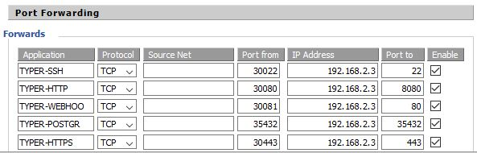
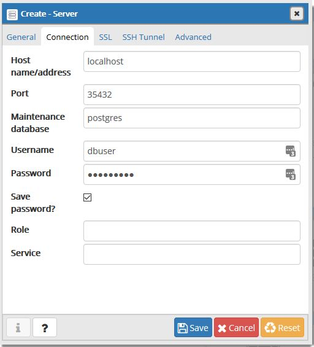

# Eigene Laufzeitumgebung

Dieses Dokument beschreibt den Aufbau und Betrieb unserer Laufzeitumgebung.

## Ziel dieser Umgebung
1. Typer ist öffentlich erreichbar (Keine wirklichen med. Daten werden in Typer vorerst gespeichert)
0. Typer aktualisiert sich selbst aus dem master Branch. Dabei aktiviert GitHub den Webhook.

## Domain
Typer ist unter http://typer.m-g.tech:30080/ oder https://typer.m-g.tech:30443/ erreichbar.\
PostgreSQL ist unter [typer.m-g.tech:35432](typer.m-g.tech:35432) erreichbar.\
Der Server ist mit [ssh:user@typer.m-g.tech:30022](ssh:user@typer.m-g.tech:30022) erreichbar.
> Die Domain m-g.tech gehört Marc Gauch und zeigt bei ihm nach Hause. Da die IANA well-known Ports teilweise bereits in Gebrauch sind, verwenden wir die well-known Ports + 30'000

## Umgebung
Virtualbox VM mit Debian Stretch.
> Dadurch kann die VM später einfach gezügelt werden.

### Installation VM
| Einstellung         | Wert                                     |
|:--------------------|:-----------------------------------------|
| Systemname          | ```typer```                                  |
| Domain Name         | [none]                                   |
| root pw             | ```2018-bfh-typer-white```                                |
| username            | ```user```                                     |
| user pw             | ```2018-bfh-typer-white```                                |
| disk                | guided, all in one partition             |
| software to install | SSH-Server, standard System Utilities |
Grub | in ```/dev/sda```

### Konfiguration VM
#### Portforwarding:
Der Netzwerktyp der VM kann so NAT bleiben und das System kann über die IP des Hypervisors angesprochen werden.
Abbildung NAT: 
> Damit später für die Entwicklung sowie den Betrieb die gleiche Datenbank verwendet werden kann wird der PostgreSQL Port nicht übersetzt sondern PostgreSQL hört auf Port 35432. (Wird später noch konfiguriert).

### Installation PostgreSQL
Gemäss dieser [Anleitung](https://wiki.debian.org/PostgreSql).
Ergänzt mit
[diesen](https://dba.stackexchange.com/questions/83984/connect-to-postgresql-server-fatal-no-pg-hba-conf-entry-for-host/84002#84002)
sowie 
[diesen](https://stackoverflow.com/questions/15934364/psql-server-closed-the-connection-unexepectedly/32844640#32844640) 
Erweiterungen.

```bash
# Installation postgreSQL
su -
apt-get update
apt-get install postgresql postgresql-client -y

# PostgreSQL Port
nano /etc/postgresql/9.6/main/postgresql.conf
# dort bei port = 5432 zu port = 35432 ändern
# PostgreSQL listen on network
printf "listen_addresses = '*'" >> /etc/postgresql/9.6/main/postgresql.conf
printf "# TYPE DATABASE USER CIDR-ADDRESS  METHOD\nhost\tall\tall\t0.0.0.0/0\ttrust" >> /etc/postgresql/9.6/main/pg_hba.conf
/etc/init.d/postgresql restart #restart service

# Create New User
adduser dbuser #password: bfh-typer
su - postgres
createuser dbuser
createdb -O dbuser typer

# Redirect typer.m-g.tech to myself
printf "127.0.0.1\ttyper.m-g.tech" >> /etc/hosts
```
Nun sollte die Verbindung mit pgAdmin möglich sein.
> Als Hostname/address ist beim Client dann _typer.m-g.tech_ zu verwenden.




### Vorbereitung System
```bash
su -
apt install -y maven apache2 php7.0 git sudo
```

### Installation Tomcat
https://www.digitalocean.com/community/tutorials/install-tomcat-9-debian-9

### Github ssh key hinzufügen
```bash
#als user
ssh-keygen #dann einfach immer enter
cat .ssh/id_rsa.pub
```
den key dann im GitHub gemäss [dieser Anleitung](https://help.github.com/articles/adding-a-new-ssh-key-to-your-github-account/) hinzufügen (evtl. nur als Deploy Key)

### maven preparations

Java SDK von [hier] herunterladen(https://www.oracle.com/technetwork/java/javase/downloads/jdk8-downloads-2133151.html)
Danach in VM kopieren unter ```/home/user/```
```bash
#Archiv entpacken
tar zxf jdk-8u191-linux-x64.tar.gz


```

### Test zum Compilieren

```bash
#als user

#JAVA_HOME variable setzen
export JAVA_HOME=/home/user/jdk1.8.0_191/

cd ~/
git clone git@github.com:daleth/ch.bfh.btx8081.w2018.white.git
cd ch.bfh.btx8081.w2018.white
cd mvn compile war:war 

#file an richtigen Ort kopieren
cp /home/user/ch.bfh.btx8081.w2018.white/target/typer-1.0-SNAPSHOT.war /opt/tomcat/webapps/ROOT.war

# restart tomcat
sudo /opt/tomcat/bin/shutdown.sh
sudo /opt/tomcat/bin/startup.sh
```
Nun sollte die Applikation laufen http://localhost:30080/

### HTTPS
https://medium.com/@raupach/how-to-install-lets-encrypt-with-tomcat-3db8a469e3d2
https://community.letsencrypt.org/t/using-lets-encrypt-with-tomcat/41082

## Webhook und autmatischer Build
Ziel ist es, dass sobald ein Commit in den Master Branch in GitHub stattfindet sich unser Server aktualisiert.
Dazu ist im Github ein Webhook eingerichtet der auf [webhook.php](webhook.php) zeigt. Dieser ruft dann [create.sh](create.sh) auf welches den Server aktualisiert.
Damit create.sh ausgeführt werden kann wird es unter ```/home/user``` platziert und mit 
```bash
su -
chmod +x /home/user/create.sh
```
ausführbar gemacht.

webhook.php gehört ins Verzeichnis ```/var/www/html/```
Dies ist das www Verzeichnis von Apache2 - dem zweiten Webserver auf unserem Server.

danach noch
```bash
echo "www-data ALL = NOPASSWD: /home/user/create.sh" >> /etc/sudoers
```
damit unsere Skripte ausführbar sind.

## ENDE
Nun sollte alles funktionieren.


